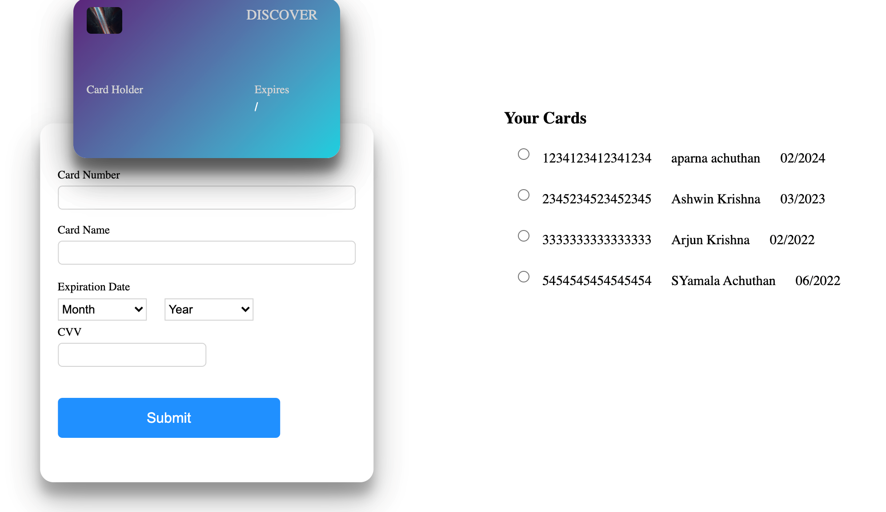
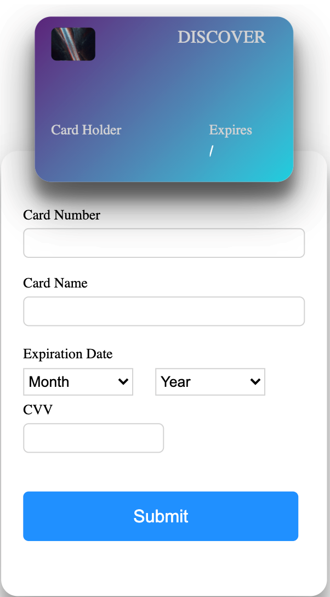
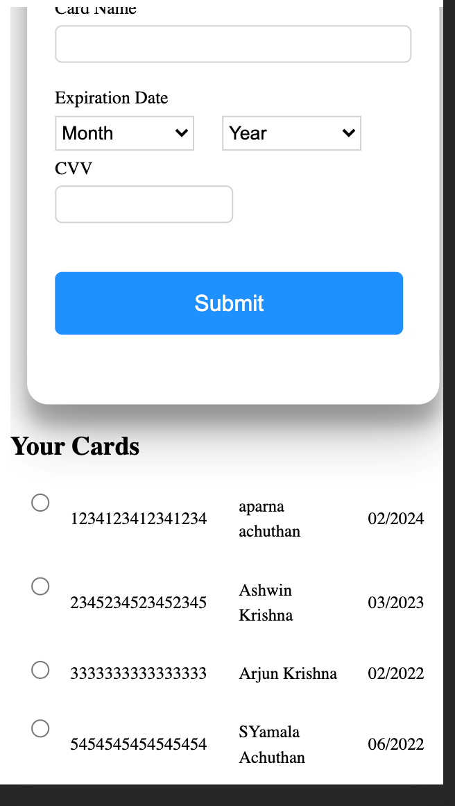

<h1 align="center">Credit card validation</h1>

<table>
  <tr>
    <td valign="top"></td>
  </tr>
  <tr>
    <td valign="top">
      

        
         
      

    </td>
  </tr>
</table>

### Project overview
The Credit card validator app allows the user to enter in credit card details, that are simultaneously reflected on the card too, 
and store the details for future reference. The cards stored are reflected in the list . The app was developed using React JS, HTML 
CSS in the front end and interfaced with firebase firestore NoSQL database.

### Features
- Form input validation.
- Storage of form data in firestore database.
- Data stored successfully in the database is reflected in the cards list.
- Fully responsive for mobile, tablet and desktop

### How to run
- git clone https://github.com/appu4ever/stomble-task.git
- npm install
- npm start
